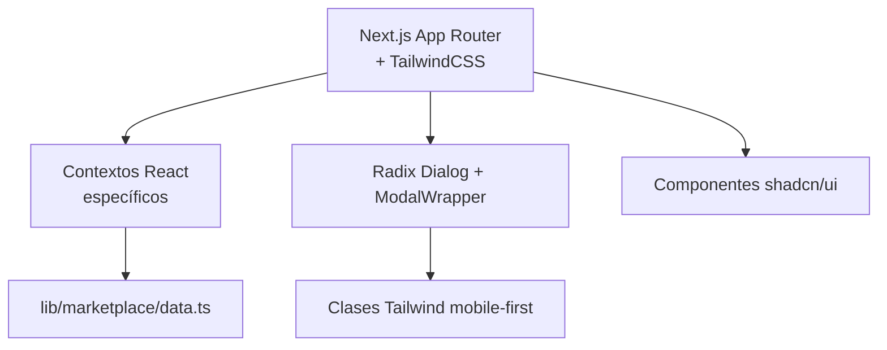
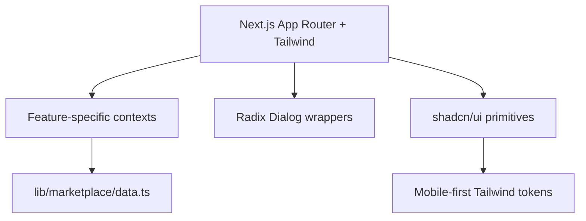

# 🏪 Koneque Marketplace · Frontend

<div align="center">
  
  
  
  
  
</div>

<div align="center" style="margin: 1.5rem 0; display: flex; gap: 0.6rem; justify-content: center; flex-wrap: wrap;">
  <a href="#-espanol" style="background:#0d47a1;color:#fff;padding:0.6rem 1.5rem;border-radius:999px;font-weight:600;text-decoration:none;display:inline-flex;align-items:center;gap:0.4rem;">🇪🇸 Leer en Español</a>
  <a href="#-english" style="background:#38bdf8;color:#0f172a;padding:0.6rem 1.5rem;border-radius:999px;font-weight:600;text-decoration:none;display:inline-flex;align-items:center;gap:0.4rem;">🇬🇧 Read in English</a>
</div>

<p align="center">
  Repositorio <strong>frontend-only</strong> del ecosistema Koneque Marketplace. Actualmente todas las pantallas funcionan con data mock y componentes client-side.
</p>

---

## 🧭 Índice global / Global index

1. [🇪🇸 Español](#-espanol)
2. [🇬🇧 English](#-english)
3. [📄 License](#-license)

---

## 🇪🇸 Español

### 🗂️ Tabla de contenidos

1. [Resumen ejecutivo](#-resumen-ejecutivo)
2. [Características clave](#-caracteristicas-clave)
3. [Capturas rápidas](#-capturas-rapidas)
4. [Arquitectura frontend](#-arquitectura-frontend)
5. [Módulos de interfaz](#-modulos-de-interfaz)
6. [Estructura del repositorio](#-estructura-del-repositorio)
7. [Requisitos y puesta en marcha](#-requisitos-y-puesta-en-marcha)
8. [Scripts y utilidades](#-scripts-y-utilidades)
9. [Notas y próximos pasos](#-notas-y-proximos-pasos)
10. [Cómo contribuir](#-como-contribuir)
11. [Soporte](#-soporte)

### 🎯 Resumen ejecutivo

> ℹ️ Proyecto **100% frontend**: actualmente no existe backend ni base de datos conectada. Todas las pantallas consumen datos estáticos desde `lib/` y contexto React.

Koneque Marketplace es una aplicación Next.js (App Router) que cubre el flujo completo de compra/venta, resolución de disputas y programa de referidos. El objetivo es ofrecer una referencia visual y funcional del producto final mientras se construyen los servicios backend.

### ✨ Características clave

| Sección | Lo que ofrece | Estado |
| --- | --- | --- |
| 🏪 **Catálogo** | Tarjetas de producto, detalles, filtros y carrito flotante | ✅ UI completa |
| 🧾 **Panel de ventas** | Línea de tiempo por pedidos, métricas y acciones rápidas | ✅ UI completa |
| 🛍️ **Panel de compras** | Seguimiento de pedidos, estados y evidencias | ✅ UI completa |
| ⚖️ **Disputas & apelaciones** | Modales Radix con formularios, jurado y flujo de revisión | ✅ UI completa |
| 👥 **Programa de referidos** | Listados por niveles, métricas y formularios de alta | ✅ UI completa |
| 📱 **Responsive** | Páginas y modales optimizados para móviles/tablet | ✅ Refinado |

### 🖼️ Capturas rápidas

<div align="center" style="display:flex;gap:0.75rem;justify-content:center;flex-wrap:wrap;margin:1rem 0;">
  
  
  
</div>

### 🧱 Arquitectura frontend



- **App Router** con rutas en `app/` y componentes client-only para cada vista.
- **Contextos** en `context/MarketplaceContext.tsx` gestionan carrito, modales y datos de QR.
- **Datos** provenientes de `lib/marketplace/data.ts` y helper `lib/utils.ts`.
- **Estilos** con Tailwind CSS y utilities personalizados.

### 🧩 Módulos de interfaz

| Módulo | Descripción detallada |
| --- | --- |
| 📦 **Marketplace** | `app/page.tsx` orquesta la landing, cards (`components/ProductCard.tsx`) y el carrito flotante (`components/marketplace/FloatingCart.tsx`). |
| 🔐 **Autenticación visual** | Botones y placeholders para futuras integraciones Web3 (Privy) sin lógica real aún. |
| ⚖️ **Disputas & Resolución** | Conjunto de modales en `components/modals/` que cubren disputa inicial, apelaciones y jurado comunitario con galerías de evidencia. |
| 💸 **Transacciones** | `app/sell-product/`, `app/send-qr/`, `app/contact-seller/` muestran flujos de venta, envío de QR y comunicación. |
| 👥 **Referidos** | `app/referred-people/` y `app/reviews/` exhiben tablas y dashboards de referidos y reputación. |

### 📂 Estructura del repositorio

```
Sistema_FrontEnd_Scaffoldeth/
├─ app/
│  ├─ page.tsx                 # Landing + marketplace
│  ├─ contact-seller/          # Flujo de contacto con vendedor
│  ├─ product-detail/          # Vista ampliada del producto
│  ├─ referred-people/         # Programa de referidos
│  ├─ reviews/                 # Panel de reseñas
│  ├─ sell-product/            # Publicación de productos
│  └─ send-qr/                 # Gestión de QR de pago
├─ components/
│  ├─ marketplace/             # UI del catálogo y carrito
│  ├─ modals/                  # Sistema de modales Radix
│  └─ ui/                      # Primitivas (button, card, etc.)
├─ context/MarketplaceContext.tsx  # Estado global de marketplace
├─ lib/
│  ├─ marketplace/data.ts      # Datos mock de productos
│  └─ utils.ts                  # Utilidades genéricas
├─ public/                      # Activos estáticos (imágenes)
└─ types/marketplace.ts         # Modelos TypeScript
```

### 🛠️ Requisitos y puesta en marcha

```bash
Node.js ≥ 18
npm ≥ 8
Git
```

```powershell
# 1. Clonar
git clone https://github.com/Koneque/Sistema_FrontEnd_Scaffoldeth.git
cd Sistema_FrontEnd_Scaffoldeth

# 2. Instalar dependencias
npm install

# 3. Variables de entorno (opcional)
Copy-Item .env.example .env.local -ErrorAction SilentlyContinue
# ⚠️ Aún no hay claves necesarias; se añadirá al integrar backend.

# 4. Ejecutar en desarrollo
npm run dev
```

### ⚙️ Scripts y utilidades

```bash
npm run dev        # Hot reload (http://localhost:3000)
npm run build      # Genera la versión de producción
npm run start      # Arranca la build previa
npm run lint       # Verificación ESLint (ignora warning de )
npm run type-check # Comprobación de tipos TypeScript
```

> ✅ No hay servicios adicionales: no se necesita base de datos ni APIs locales para visualizar el proyecto.

### 🗒️ Notas y próximos pasos

- [ ] Conectar el frontend a servicios reales (REST/GraphQL) cuando estén listos.
- [ ] Sustituir datos mock por respuestas dinámicas.
- [ ] Migrar `` a `next/image` para aprovechar la optimización nativa.
- [ ] Añadir Storybook o Chromatic para documentar componentes críticos.

### 🤝 Cómo contribuir

1. Crea un fork y clona tu repositorio.
2. Instala dependencias y ejecuta `npm run dev` para validar cambios.
3. Sigue la convención de commits (`feat:`, `fix:`, `docs:`...).
4. Incluye capturas o GIFs en el PR si afectan al diseño.

### 📞 Soporte

- 📧 `support@koneque.com`
- 💬 Discord del equipo (solicitar invitación)
- 🐛 [GitHub Issues](https://github.com/Koneque/Sistema_FrontEnd_Scaffoldeth/issues)

---

## 🇬🇧 English

### 🗂️ Table of contents

1. [Executive summary](#-executive-summary)
2. [Key highlights](#-key-highlights)
3. [Visual snapshots](#-visual-snapshots)
4. [Frontend architecture](#-frontend-architecture)
5. [Interface modules](#-interface-modules)
6. [Repository structure](#-repository-structure)
7. [Requirements & setup](#-requirements--setup)
8. [Scripts & tooling](#-scripts--tooling)
9. [Notes & next steps](#-notes--next-steps)
10. [Contributing](#-contributing)
11. [Support](#-support)

### 🎯 Executive summary

> ℹ️ This repository is **frontend-only** for now. All views rely on mocked data defined under `lib/` and scoped React contexts—no backend or database is connected yet.

Koneque Marketplace showcases the full buying/selling, dispute resolution and referral experience using Next.js 14, Tailwind CSS and Radix Dialog. It acts as the visual contract while backend services are being built.

### ✨ Key highlights

| Area | Description | Status |
| --- | --- | --- |
| 🏪 **Marketplace** | Product cards, filters, floating cart | ✅ UI complete |
| 📊 **Sales hub** | Timeline per order, metrics dashboard | ✅ UI complete |
| 🛍️ **Purchases hub** | Buyer tracking, dispute triggers | ✅ UI complete |
| ⚖️ **Disputes & appeals** | Radix-driven modals for every stage | ✅ UI complete |
| 👥 **Referrals** | Multi-level tables, cards and forms | ✅ UI complete |
| 📱 **Responsiveness** | Tailored layouts for phone, tablet, desktop | ✅ Polished |

### 🖼️ Visual snapshots

<div align="center" style="display:flex;gap:0.75rem;justify-content:center;flex-wrap:wrap;margin:1rem 0;">
  
  
  
</div>

### 🧱 Frontend architecture



- App Router pages live in `app/`, using client components.
- Global marketplace state is handled via `context/MarketplaceContext.tsx`.
- UI elements are composed from the `components/` directory (marketplace widgets + modal system + shadcn primitives).
- Styles are managed with Tailwind, favoring utility classes and responsive design tokens.

### 🧩 Interface modules

| Module | Details |
| --- | --- |
| 📦 **Marketplace** | `app/page.tsx` ties together product grids, hero sections and the floating cart component. |
| 🧾 **Transactions** | Dedicated pages (`app/sell-product/`, `app/send-qr/`, `app/contact-seller/`) illustrate listing, QR handling and seller communication. |
| ⚖️ **Dispute suite** | `components/modals/` covers disputes, appeals, jury decisions and balance operations (deposit/receive). |
| 👥 **Referrals & reviews** | `app/referred-people/` and `app/reviews/` show referral hierarchies, stats and testimonials. |

### 📂 Repository structure

```
Sistema_FrontEnd_Scaffoldeth/
├─ app/
│  ├─ page.tsx
│  ├─ contact-seller/
│  ├─ product-detail/
│  ├─ referred-people/
│  ├─ reviews/
│  ├─ sell-product/
│  └─ send-qr/
├─ components/
│  ├─ marketplace/
│  ├─ modals/
│  └─ ui/
├─ context/MarketplaceContext.tsx
├─ lib/marketplace/data.ts
├─ lib/utils.ts
├─ public/
└─ types/marketplace.ts
```

### 🛠️ Requirements & setup

```bash
Node.js ≥ 18
npm ≥ 8
Git
```

```powershell
# Clone the repo
git clone https://github.com/Koneque/Sistema_FrontEnd_Scaffoldeth.git
cd Sistema_FrontEnd_Scaffoldeth

# Install dependencies
npm install

# Optional: create a local env file (no keys are required yet)
if (!(Test-Path .env.local) -and (Test-Path .env.example)) { Copy-Item .env.example .env.local }

# Start the dev server
npm run dev
```

### ⚙️ Scripts & tooling

```bash
npm run dev        # Development server (http://localhost:3000)
npm run build      # Production build output
npm run start      # Runs the build
npm run lint       # ESLint (ignore  warnings for now)
npm run type-check # TypeScript diagnostics
```

> ✅ No additional services are required—open the browser and explore.

### 🗒️ Notes & next steps

- [ ] Wire the UI to real backend services and APIs.
- [ ] Replace mocked data with live responses.
- [ ] Adopt `next/image` for gallery components.
- [ ] Introduce automated visual testing (Storybook/Chromatic).

### 🤝 Contributing

1. Fork the project and clone your copy.
2. Install dependencies, run `npm run dev` and verify your changes locally.
3. Use conventional commits (`feat:`, `fix:`, `docs:`...).
4. Provide screenshots or GIFs in pull requests that touch the UI.

### 📞 Support

- 📧 `support@koneque.com`
- 💬 Team Discord (request an invite)
- 🐛 [GitHub Issues](https://github.com/Koneque/Sistema_FrontEnd_Scaffoldeth/issues)

---

## 📄 License

```
MIT License

Copyright (c) 2025 Koneque Marketplace

Permission is hereby granted, free of charge, to any person obtaining a copy
of this software and associated documentation files (the "Software"), to deal
in the Software without restriction, including without limitation the rights
to use, copy, modify, merge, publish, distribute, sublicense, and/or sell
copies of the Software, and to permit persons to whom the Software is
furnished to do so, subject to the following conditions:

The above copyright notice and this permission notice shall be included in all
copies or substantial portions of the Software.

THE SOFTWARE IS PROVIDED "AS IS", WITHOUT WARRANTY OF ANY KIND, EXPRESS OR
IMPLIED, INCLUDING BUT NOT LIMITED TO THE WARRANTIES OF MERCHANTABILITY,
FITNESS FOR A PARTICULAR PURPOSE AND NONINFRINGEMENT. IN NO EVENT SHALL THE
AUTHORS OR COPYRIGHT HOLDERS BE LIABLE FOR ANY CLAIM, DAMAGES OR OTHER
LIABILITY, WHETHER IN AN ACTION OF CONTRACT, TORT OR OTHERWISE, ARISING FROM,
OUT OF OR IN CONNECTION WITH THE SOFTWARE OR THE USE OR OTHER DEALINGS IN THE
SOFTWARE.
```

<div align="center" style="margin-top: 2rem; display:flex;flex-direction:column;gap:0.75rem;">

**🏪 Built with ❤️ by the Koneque team**

<div>
  <a href="https://github.com/Koneque/Sistema_FrontEnd_Scaffoldeth/stargazers"></a>
  <a href="https://github.com/Koneque/Sistema_FrontEnd_Scaffoldeth/network/members"></a>
  <a href="https://github.com/Koneque/Sistema_FrontEnd_Scaffoldeth/issues"></a>
</div>

<div>
  <a href="https://koneque.com">🏠 Homepage</a> •
  <a href="https://docs.koneque.com">📚 Documentation</a> •
  <a href="https://discord.gg/koneque">💬 Community</a> •
  <a href="https://github.com/Koneque/Sistema_FrontEnd_Scaffoldeth/issues">🐛 Report bug</a>
</div>

</div>
