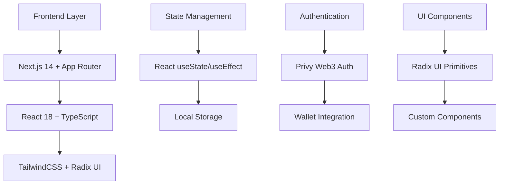
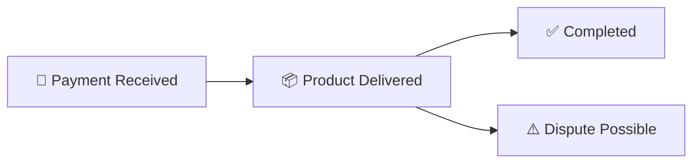
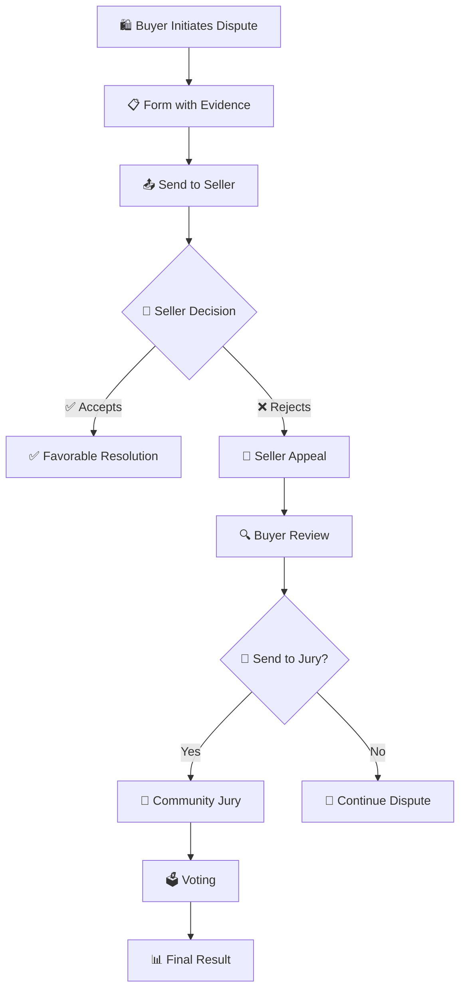
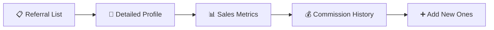
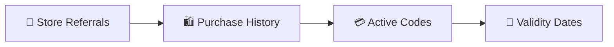
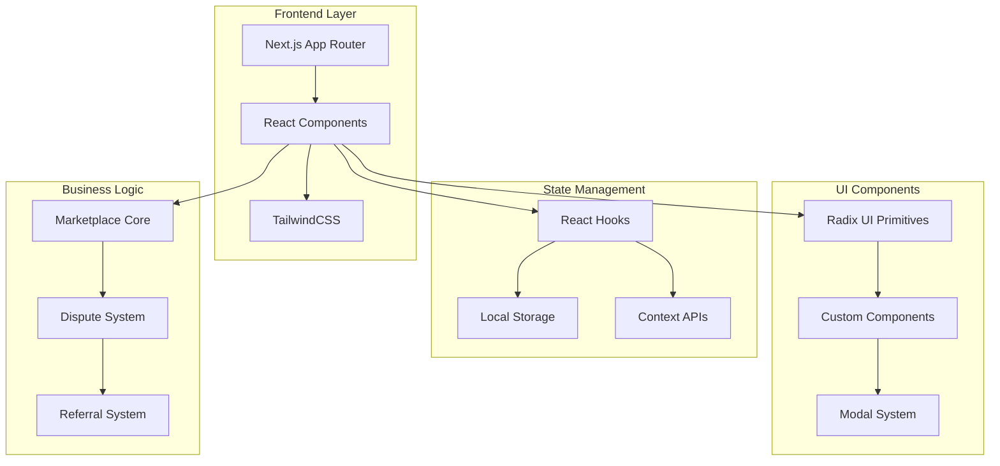
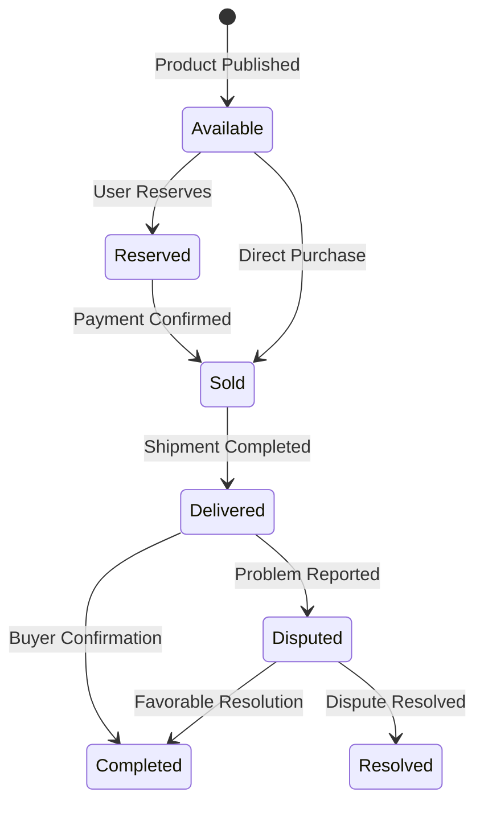
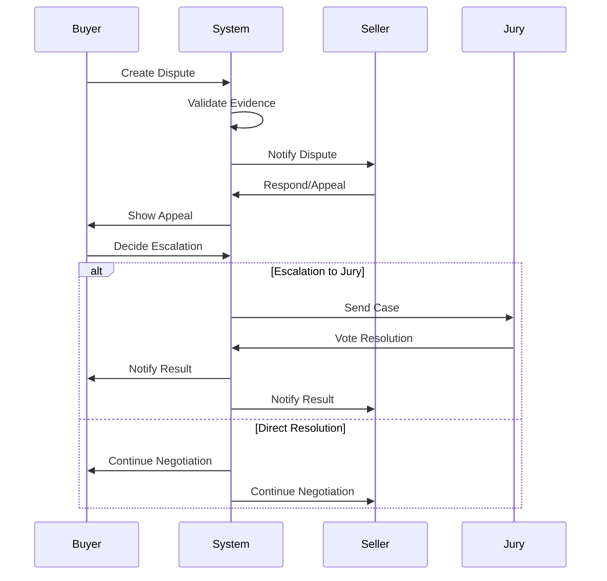
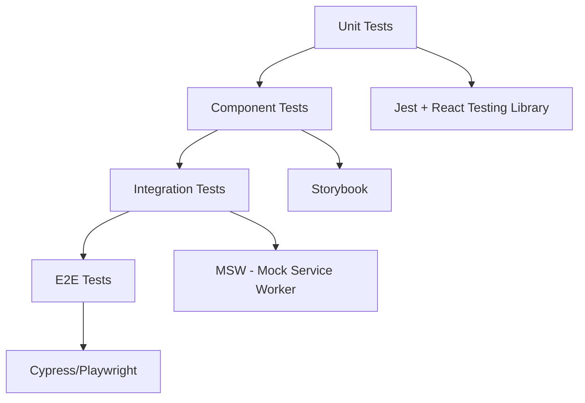

# 🏪 **Koneque Marketplace** - Complete E-commerce System

<div align="center">


**A complete marketplace platform with advanced dispute system, sales management, and referral program**

</div>

---

## 📋 **Table of Contents**

- [🎯 Overview](#-overview)
- [🚀 Quick Start](#-quick-start)
- [🏗️ System Architecture](#️-system-architecture)
- [🛠️ Technologies Used](#️-technologies-used)
- [📱 System Modules](#-system-modules)
- [🔄 User Flows](#-user-flows)
- [📊 System Diagrams](#-system-diagrams)
- [🎨 Design System](#-design-system)
- [📁 Project Structure](#-project-structure)
- [🔧 Configuration and Development](#-configuration-and-development)
- [📚 API Documentation](#-api-documentation)
- [🧪 Testing](#-testing)
- [🚀 Deployment](#-deployment)
- [🤝 Contributing](#-contributing)

---

## 🎯 **Overview**

Koneque is a next-generation marketplace platform that integrates blockchain technology with advanced e-commerce functionalities. The system includes complete sales management, dispute system with community jury, multi-level referral program, and optimized user experience.

### ✨ **Main Features**

| Feature | Description | Status |
|---------|-------------|--------|
| 🛒 **Marketplace Core** | Product catalog, cart, advanced filters | ✅ Complete |
| 📊 **Sales Panel** | Product tracking in sales with states | ✅ Complete |
| 🛍️ **Purchases Panel** | Purchase management and status tracking | ✅ Complete |
| ⚖️ **Dispute System** | Conflict resolution between buyers and sellers | ✅ Complete |
| 👥 **Community Jury** | Voting system for dispute resolution | ✅ Complete |
| 🎯 **Referral Program** | Multi-level commission system for referrals | ✅ Complete |
| 🔐 **Authentication** | Privy integration for Web3 wallets | ✅ Integrated |
| 🎨 **Advanced UI/UX** | Responsive interface with custom color system | ✅ Complete |

---

## 🚀 **Quick Start**

### Prerequisites
```bash
Node.js >= 18.0.0
npm >= 8.0.0
Git
```

### Installation and Execution

```powershell
# Clone the repository
git clone https://github.com/Koneque/Sistema_FrontEnd_Scaffoldeth.git
cd frontend-kneque

# Install dependencies
npm install

# Run in development mode
npm run dev

# Open in browser
# http://localhost:3000
```

### Available Scripts

```bash
npm run dev          # Development server
npm run build        # Production build
npm run start        # Production server
npm run lint         # ESLint linter
npm run type-check   # TypeScript type checking
```

---

## 🏗️ **System Architecture**

### 🔧 **Technology Stack**



### 🏛️ **Architectural Patterns**

- **🎯 Component-Based Architecture**: Reusable and modular components
- **📱 Mobile-First Design**: Responsive design from mobile devices
- **🔄 State Management**: Local state management with React Hooks
- **🎨 Design System**: Consistent color and component system
- **📦 Modular Structure**: Clear separation of responsibilities

---

## 📱 **System Modules**

### 1. 🏪 **Marketplace Core**

Main marketplace functionality with product catalog and cart management.

#### Features:
- **🔍 Advanced Search**: Filters by category, condition, location and price
- **📋 Product View**: Grid/List with detailed information
- **🛒 Smart Cart**: Quantity management and local persistence
- **❤️ Wishlist**: User favorites
- **📱 Responsive Interface**: Optimized for all devices

#### Product States:
```typescript
type ProductStatus = 'available' | 'sold' | 'reserved' | 'disputed'
type ProductCondition = 'new' | 'like new' | 'used' | 'refurbished'
```

### 2. 📊 **Sales System**

Complete panel for sellers with product tracking in three stages.

#### State Flow:


#### Features:
- **📈 Sales Metrics**: Revenue, products sold, ratings
- **🔄 Automatic States**: Automatic transition between stages
- **📊 Visual Dashboard**: Progress indicators and statistics
- **🎯 Referral Access**: Direct integration with referral system

### 3. 🛍️ **Purchase System**

Panel for buyers with order tracking and dispute options.

#### Features:
- **📦 Order Tracking**: Real-time status updates
- **⚖️ Dispute Initiation**: Integrated conflict resolution system
- **⭐ Rating System**: Feedback for sellers
- **🎯 Referral Program**: Access from purchase panel

### 4. ⚖️ **Advanced Dispute System**

Complete conflict resolution system with multiple stages and evidence.

#### Dispute Flow:


#### System Features:
- **📋 Dispute Creation**: Detailed form with evidence upload
- **🖼️ Evidence Gallery**: Support for up to 5 images per dispute
- **📝 Appeal System**: Sellers can appeal with new evidence
- **🔍 Appeal Review**: Buyers can review and decide
- **👥 Community Jury**: Democratic voting system

#### Dispute States:
```typescript
type DisputeStatus = 'open' | 'under review' | 'appealed' | 'in jury' | 'resolved'
type EvidenceType = 'image' | 'document' | 'video'
```

### 5. 👥 **Community Jury**

Democratic system for final resolution of complex disputes.

#### Voting Process:
- **📊 Case Presentation**: Complete dispute information
- **🖼️ Evidence Review**: Navigable evidence gallery
- **🗳️ Binary Voting**: "Successful Dispute" vs "Failed Dispute"
- **📈 Democratic Result**: Decision based on majority

#### Features:
```typescript
interface JuryCase {
  id: string
  disputeId: string
  evidenceGallery: Evidence[]
  votingOptions: ['Successful Dispute', 'Failed Dispute']
  currentVotes: VoteRecord[]
  status: 'voting' | 'completed'
}
```

### 6. 🎯 **Multi-level Referral Program**

Complete referral system with specific contexts and commissions.

#### System Contexts:
- **🏠 Navbar View**: General program information
- **👨‍💼 Seller View**: Detailed referral management with metrics
- **👨‍💻 Buyer View**: Referral tracking as buyer

#### Features by Context:

##### 👨‍💼 **Seller View**:


##### 👨‍💻 **Buyer View**:


#### New Referral Form:
```typescript
interface NewReferral {
  name: string
  walletAddress: string
  referralCode: string
  validUntil: string
}
```

---

## 🔄 **User Flows**

### 🛒 **Standard Purchase Flow**
1. **🔍 Exploration**: User navigates products with filters
2. **🛒 Selection**: Add products to cart
3. **💳 Checkout**: Payment process (future integration)
4. **📦 Tracking**: Monitoring in purchase panel
5. **⭐ Rating**: Feedback to seller

### ⚖️ **Dispute Resolution Flow**
1. **🚨 Initiation**: Buyer detects problem
2. **📋 Documentation**: Complete form with evidence
3. **📤 Notification**: Seller receives dispute
4. **🤝 Negotiation**: Attempt direct resolution
5. **👥 Escalation**: Community jury if necessary
6. **📊 Resolution**: Final binding decision

### 🎯 **Referral Flow**
1. **🔗 Generation**: Create unique referral link
2. **📤 Share**: Distribution through networks
3. **👤 Registration**: New users register
4. **💰 Commissions**: Payment automation (5%)
5. **📊 Tracking**: Real-time metrics

---

## 📊 **System Diagrams**

### 🏛️ **General Architecture**


### 🔄 **Product State Flow**


### ⚖️ **Dispute System**


---

## 🎨 **Design System**

### 🎨 **Color Palette**

| Color | Hex | Usage | Example |
|-------|-----|-------|---------|
|  **Primary Blue** | `#0d47a1` | Main backgrounds, navigation | Modals, headers |
|  **Turquoise** | `#00bcd4` | Accents, primary buttons | CTAs, icons |
|  **Amber** | `#ff9800` | Alerts, important metrics | Notifications, stats |
|  **Success Green** | `#4caf50` | Successful states | Confirmations |
|  **Error Red** | `#f44336` | Errors, critical alerts | Disputes, errors |

### 🔤 **Typography**
- **Primary**: Inter (system font fallback)
- **Secondary**: SF Pro Display (Apple devices)
- **Monospace**: JetBrains Mono (code)

### 📐 **Spacing and Layout**
```css
/* Spacing Scale */
--space-1: 0.25rem;  /* 4px */
--space-2: 0.5rem;   /* 8px */
--space-3: 0.75rem;  /* 12px */
--space-4: 1rem;     /* 16px */
--space-6: 1.5rem;   /* 24px */
--space-8: 2rem;     /* 32px */

/* Border Radius */
--radius-sm: 0.375rem;  /* 6px */
--radius-md: 0.5rem;    /* 8px */
--radius-lg: 0.75rem;   /* 12px */
--radius-xl: 1rem;      /* 16px */
```

### 🎭 **Base Components**

#### Buttons
```typescript
type ButtonVariant = 'default' | 'outline' | 'ghost' | 'destructive'
type ButtonSize = 'sm' | 'md' | 'lg' | 'xl'
```

#### Modals
```typescript
interface ModalProps {
  side: 'left' | 'right' | 'top' | 'bottom'
  size: 'sm' | 'md' | 'lg' | 'xl' | 'full'
  overlay: boolean
  closeOnOutsideClick: boolean
}
```

---

## 📁 **Project Structure**

```
frontend-kneque/
├── 📱 app/                          # Next.js App Router
│   ├── favicon.ico                  # Favicon
│   ├── globals.css                  # Global styles
│   ├── layout.tsx                   # Main layout
│   ├── loading.tsx                  # Loading component
│   └── page.tsx                     # Main page (5000+ lines)
│
├── 🧩 components/                   # Reusable components
│   └── ui/                          # UI primitives
│       ├── badge.tsx                # Badges and labels
│       ├── button.tsx               # Main buttons
│       ├── card.tsx                 # Content cards
│       ├── input.tsx                # Input fields
│       ├── label.tsx                # Form labels
│       ├── select.tsx               # Dropdown selectors
│       ├── separator.tsx            # Visual dividers
│       ├── sheet.tsx                # Slide modals
│       ├── slider.tsx               # Slider controls
│       └── textarea.tsx             # Text areas
│
├── 🛠️ lib/                          # Utilities and helpers
│   └── utils.ts                     # Utility functions
│
├── 🖼️ public/                       # Static assets
│   ├── file.svg                     # SVG icons
│   ├── globe.svg
│   ├── next.svg
│   ├── vercel.svg
│   └── window.svg
│
├── ⚙️ Configuration Files
│   ├── components.json              # Shadcn/ui config
│   ├── eslint.config.mjs           # ESLint
│   ├── next-env.d.ts               # Next.js types
│   ├── next.config.ts              # Next.js config
│   ├── package.json                # Dependencies
│   ├── postcss.config.mjs          # PostCSS
│   ├── README.md                   # Documentation
│   └── tsconfig.json               # TypeScript config
```

### 📊 **Code Metrics**
- **📄 Main File**: `app/page.tsx` (5,000+ lines)
- **🧩 UI Components**: 10 base components
- **🎨 Styles**: TailwindCSS + custom CSS
- **📝 TypeScript**: 100% static typing
- **📱 Responsive**: Mobile-first design

---

## 🔧 **Configuration and Development**

### 🛠️ **Environment Variables**

```bash
# .env.local
NEXT_PUBLIC_PRIVY_APP_ID=your_privy_app_id
NEXT_PUBLIC_WALLET_CONNECT_PROJECT_ID=your_wc_project_id
NEXT_PUBLIC_CHAIN_ID=1
```

### 📦 **Main Dependencies**

```json
{
  "dependencies": {
    "next": "^14.0.0",
    "react": "^18.0.0",
    "typescript": "^5.0.0",
    "@radix-ui/react-sheet": "^1.0.0",
    "@privy-io/react-auth": "^1.0.0",
    "tailwindcss": "^3.0.0",
    "lucide-react": "^0.400.0"
  }
}
```

### 🚀 **Development Scripts**

```bash
# Development
npm run dev              # Development server (http://localhost:3000)
npm run build            # Optimized production build
npm run start            # Production server
npm run lint             # Code verification
npm run type-check       # TypeScript verification
```

### 🐳 **Docker (Optional)**

```dockerfile
FROM node:18-alpine
WORKDIR /app
COPY package*.json ./
RUN npm install
COPY . .
RUN npm run build
EXPOSE 3000
CMD ["npm", "start"]
```

---

## 📚 **API Documentation**

### 🔌 **Main Interfaces**

#### Product Interface
```typescript
interface Product {
  id: string
  name: string
  description: string
  price: number
  images: string[]
  category: ProductCategory
  condition: ProductCondition
  location: string
  seller: Seller
  status: ProductStatus
  createdAt: Date
  updatedAt: Date
}
```

#### Dispute Interface
```typescript
interface Dispute {
  id: string
  purchaseId: string
  buyerId: string
  sellerId: string
  reason: string
  description: string
  evidence: Evidence[]
  status: DisputeStatus
  sellerResponse?: string
  sellerEvidence?: Evidence[]
  juryVotes?: JuryVote[]
  resolution?: DisputeResolution
  createdAt: Date
  resolvedAt?: Date
}
```

#### Referral Interface
```typescript
interface Referral {
  id: string
  referrerId: string
  referredId: string
  referralCode: string
  commissionRate: number
  totalEarnings: number
  status: 'active' | 'inactive' | 'suspended'
  validUntil: Date
  createdAt: Date
}
```

### 🔄 **System States**

#### Product Status Flow
```typescript
type ProductStatus = 
  | 'available'      // Available for purchase
  | 'reserved'       // Reserved by buyer
  | 'sold'          // Sold (payment received)
  | 'delivered'     // Delivered to buyer
  | 'completed'     // Transaction completed
  | 'disputed'      // In dispute process
  | 'cancelled'     // Cancelled
```

#### Dispute Status Flow
```typescript
type DisputeStatus = 
  | 'created'       // Dispute created by buyer
  | 'pending'       // Waiting for seller response
  | 'responded'     // Seller has responded
  | 'appealed'      // Seller has appealed
  | 'jury_review'   // Under jury review
  | 'resolved'      // Definitively resolved
```

---

## 🧪 **Testing**

### 🧪 **Testing Strategy**



### 📋 **Main Test Cases**

#### Unit Tests
```bash
# UI Components
✅ Button: variants, sizes, interactions
✅ Card: layout, responsive behavior
✅ Modal: open/close, keyboard navigation
✅ Form: validation, submission

# Business Logic
✅ Dispute workflow states
✅ Referral calculations
✅ Cart management
✅ Product filtering
```

#### Integration Tests
```bash
# User Flows
✅ Complete purchase flow
✅ Dispute creation and resolution
✅ Referral program enrollment
✅ Product search and filtering
```

#### E2E Tests
```bash
# Critical Paths
✅ User registration and authentication
✅ End-to-end purchase process
✅ Complete dispute resolution cycle
✅ Referral program functionality
```

### 🚀 **Running Tests**

```bash
# Unit tests
npm run test              # Jest test runner
npm run test:watch        # Watch mode
npm run test:coverage     # Coverage report

# E2E tests
npm run e2e              # Cypress tests
npm run e2e:headless     # Headless mode

# Component tests
npm run storybook        # Storybook dev server
npm run build-storybook  # Build storybook
```

---

## 🚀 **Deployment**

### 🌐 **Deployment Options**

#### Vercel (Recommended)
```bash
# Automatic deployment
npm install -g vercel
vercel

# Environment variables
vercel env add NEXT_PUBLIC_PRIVY_APP_ID production
vercel env add NEXT_PUBLIC_WALLET_CONNECT_PROJECT_ID production
```

#### Netlify
```bash
# Build command
npm run build

# Publish directory
out/

# Environment variables
NEXT_PUBLIC_PRIVY_APP_ID=your_value
NEXT_PUBLIC_WALLET_CONNECT_PROJECT_ID=your_value
```

#### Docker
```bash
# Build image
docker build -t koneque-marketplace .

# Run container
docker run -p 3000:3000 koneque-marketplace

# Docker Compose
docker-compose up -d
```

### 🔧 **Production Configuration**

#### Next.js Config
```typescript
// next.config.ts
const nextConfig = {
  output: 'export',
  trailingSlash: true,
  images: {
    unoptimized: true
  },
  env: {
    CUSTOM_KEY: process.env.CUSTOM_KEY,
  }
}
```

#### Performance Optimizations
```typescript
// Lazy loading components
const DisputeModal = lazy(() => import('./components/DisputeModal'))
const ReferralModal = lazy(() => import('./components/ReferralModal'))

// Image optimization
import Image from 'next/image'

// Bundle analysis
npm run analyze
```

---

## 🎯 **Roadmap and Future Improvements**

### 📅 **Phase 1: Core Enhancements**
- [ ] 🔐 **Backend Integration**: REST/GraphQL API
- [ ] 💾 **Database**: PostgreSQL + Prisma ORM
- [ ] 🔑 **Advanced Auth**: Multi-factor authentication
- [ ] 📱 **PWA**: Progressive Web App capabilities

### 📅 **Phase 2: Advanced Features**
- [ ] 🤖 **AI Integration**: Product recommendations
- [ ] 💬 **Real-time Chat**: Buyer-seller communication
- [ ] 📊 **Analytics Dashboard**: Advanced metrics
- [ ] 🌍 **Internationalization**: Multi-language support

### 📅 **Phase 3: Blockchain Integration**
- [ ] ⛓️ **Smart Contracts**: Automated dispute resolution
- [ ] 💰 **DeFi Integration**: Yield farming for stakers
- [ ] 🏆 **NFT Marketplace**: Digital collectibles
- [ ] 🗳️ **DAO Governance**: Community voting

### 📅 **Phase 4: Ecosystem Expansion**
- [ ] 📱 **Mobile Apps**: iOS/Android native
- [ ] 🛒 **White-label**: Marketplace-as-a-Service
- [ ] 🔌 **API Platform**: Third-party integrations
- [ ] 🌐 **Global Expansion**: Multi-region deployment

---

## 🤝 **Contributing**

### 🛠️ **Contribution Guide**

#### 1. Fork and Setup
```bash
# Fork the repository
gh repo fork Koneque/Sistema_FrontEnd_Scaffoldeth

# Clone your fork
git clone https://github.com/your-username/Sistema_FrontEnd_Scaffoldeth.git
cd Sistema_FrontEnd_Scaffoldeth

# Install dependencies
npm install
```

#### 2. Development
```bash
# Create feature branch
git checkout -b feature/new-functionality

# Make changes and commits
git add .
git commit -m "✨ Add: new functionality"

# Push and PR
git push origin feature/new-functionality
```

#### 3. Standards
- **🎨 Code Style**: Prettier + ESLint
- **📝 Commits**: Conventional Commits
- **🧪 Testing**: Required for new features
- **📚 Docs**: Update README for significant changes

### 🏷️ **Commit Conventions**

```bash
✨ feat: new functionality
🐛 fix: bug correction
📚 docs: documentation update
🎨 style: format/style changes
♻️ refactor: code refactoring
⚡ perf: performance improvements
🧪 test: add or update tests
🔧 chore: maintenance tasks
```

### 👥 **Development Team**

| Role | Responsibility | Contact |
|-----|----------------|----------|
| 🏗️ **Tech Lead** | Architecture and technical decisions | tech@koneque.com |
| 🎨 **UI/UX Lead** | Design and user experience | design@koneque.com |
| ⚖️ **Product Manager** | Roadmap and functionalities | product@koneque.com |
| 🔐 **Security Lead** | Security and audits | security@koneque.com |

---

## 📞 **Support and Community**

### 🆘 **Support Channels**

| Channel | Purpose | Link |
|-------|-----------|--------|
| 📧 **Email** | Official technical support | support@koneque.com |
| 💬 **Discord** | Developer community | [Discord Server](#) |
| 🐛 **GitHub Issues** | Report bugs and features | [Issues](https://github.com/Koneque/Sistema_FrontEnd_Scaffoldeth/issues) |
| 📚 **Documentation** | Guides and tutorials | [Docs](https://docs.koneque.com) |

### 🏆 **Acknowledgments**

- **🎨 Design System**: Inspired by Shadcn/ui
- **🧩 Components**: Radix UI Primitives
- **🎭 Icons**: Lucide React
- **⚡ Framework**: Next.js Team
- **🎨 Styling**: Tailwind CSS

---

## 📄 **License**

```
MIT License

Copyright (c) 2025 Koneque Marketplace

Permission is hereby granted, free of charge, to any person obtaining a copy
of this software and associated documentation files (the "Software"), to deal
in the Software without restriction, including without limitation the rights
to use, copy, modify, merge, publish, distribute, sublicense, and/or sell
copies of the Software, and to permit persons to whom the Software is
furnished to do so, subject to the following conditions:

The above copyright notice and this permission notice shall be included in all
copies or substantial portions of the Software.

THE SOFTWARE IS PROVIDED "AS IS", WITHOUT WARRANTY OF ANY KIND, EXPRESS OR
IMPLIED, INCLUDING BUT NOT LIMITED TO THE WARRANTIES OF MERCHANTABILITY,
FITNESS FOR A PARTICULAR PURPOSE AND NONINFRINGEMENT. IN NO EVENT SHALL THE
AUTHORS OR COPYRIGHT HOLDERS BE LIABLE FOR ANY CLAIM, DAMAGES OR OTHER
LIABILITY, WHETHER IN AN ACTION OF CONTRACT, TORT OR OTHERWISE, ARISING FROM,
OUT OF OR IN CONNECTION WITH THE SOFTWARE OR THE USE OR OTHER DEALINGS IN THE
SOFTWARE.
```

---

<div align="center">

**🏪 Built with ❤️ by the Koneque team**

[](https://github.com/Koneque/Sistema_FrontEnd_Scaffoldeth/stargazers)
[](https://github.com/Koneque/Sistema_FrontEnd_Scaffoldeth/network/members)
[](https://github.com/Koneque/Sistema_FrontEnd_Scaffoldeth/issues)

[🏠 Homepage](https://koneque.com) • [📚 Docs](https://docs.koneque.com) • [💬 Community](https://discord.gg/koneque) • [🐛 Report Bug](https://github.com/Koneque/Sistema_FrontEnd_Scaffoldeth/issues)

</div>
